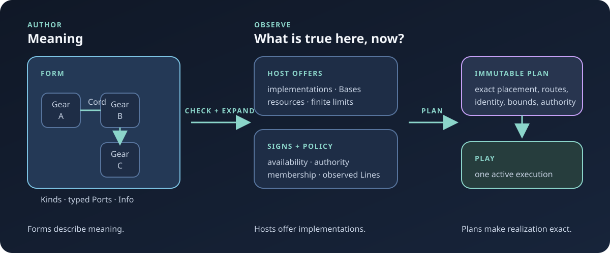
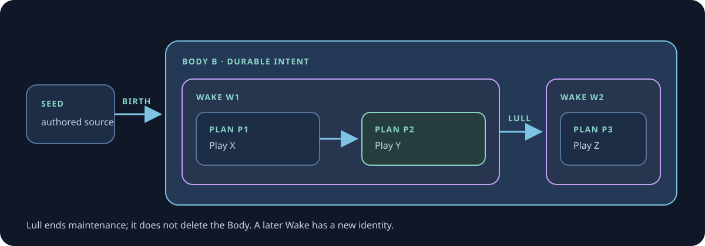
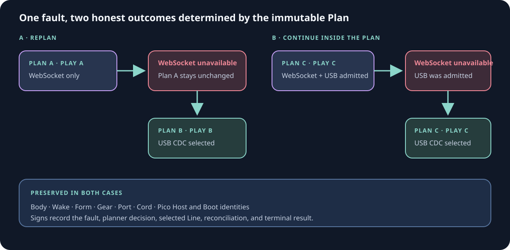
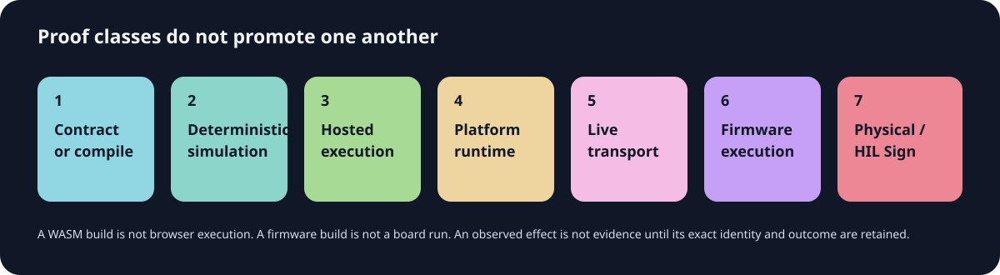

# Conduit

**Wire meaning together. Let Conduit work out how that meaning can exist here, now.**

Conduit is an experimental programming system for finite, typed flows of work. A program is authored as a semantic graph—a **Form**—without embedding the operating system, browser, microcontroller, process, device, or transport that must eventually realize it. **Hosts** truthfully offer implementations and resources. An immutable **Plan** makes one realization exact. A **Play** executes that Plan through one bounded kernel.

The same meaning can therefore run locally, in a real browser, on constrained firmware, across live Lines, or under ConduitOS without pretending those environments are identical.



> **Forms describe meaning. Hosts offer implementations. Plans make realization exact.**

Conduit is not merely a visual node editor, workflow service, message broker, browser application, robotics stack, or RTOS. It may present surfaces resembling all of them, but they remain profiles of the same substrate. None gets a second semantic graph, scheduler, authority model, or source of runtime truth.

## Start here

For an installed Conduit, Patchbay is the shared product front door:

```sh
conduit patchbay --on native
conduit patchbay --on browser
```

From a source checkout, the friendly Patchbay recipe delegates to its repository entrance:

```sh
just patchbay  # cargo xtask demo patchbay --on native
```

Both Patchbay realizations begin from the same world-first truth: this Host is present and its current Body may be `NONE`. Opening a discovered Body or repository Seed is inspection-only. Explicit `JOIN` or `BIRTH` establishes membership or births a Body. From there, Patchbay exposes the checked meaning, Parts, truthful Lines, immutable Plan, active Play, and bounded Signs.

The native window and browser document are different planned **Manifestations** of the same structural subjects. Their pixels, DOM nodes, window handles, and layout are presentation details—not another topology or runtime.

The deterministic front-door acceptance suite has one repository entrance:

```sh
cargo xtask prove patchbay-front-door
```

[](https://dancxjo.github.io/conduit/current/patchbay/overview/)

The linked evidence page records the accepted commit, browser, viewport, digest, and semantic provenance. The Form, Plan, Play, and Signs remain authoritative; the screenshot does not.

## A small Form

Canonical source describes graph meaning:

```conduit
form signal-demo {
    pulse: flow/pulse(count = 16, period-ms = 250, initial = false)
    show: presentation/show
    pulse > show
}
```

`flow/pulse` and `presentation/show` are reusable semantic **Kinds**. `pulse` and `show` are configured occurrences of those Kinds: **Gears**. Their exact typed **Ports** are joined by a **Cord**, and shaped, typed **Info** flows through it.

The Form does not say that `show` means stdout, that both Gears share a process, or that a cross-machine Cord uses WebSocket, USB CDC, or anything else. Those are realization facts selected only after Conduit knows what the available Hosts can truthfully offer.

Run the retained compatibility fixture for this example on the native std Host:

```sh
cargo xtask demo std
```

That command parses and checks the Form, observes the real std Host, creates an exact Plan, lowers its admitted fragment, and executes sixteen values through `conduit-kernel` to the selected presentation implementation.

## The semantic graph

Most authored meaning is built from five concepts:

| Concept | Meaning | It is not |
|---|---|---|
| **Kind** | Reusable semantic behavior and its contract | A Rust function, process, thread, or machine implementation |
| **Gear** | One configured occurrence of a Kind in a Form | The Kind itself or a runtime task identity |
| **Port** | An exact typed, directional point with a temporal contract | A queue slot, socket, Base handle, or drawn jack |
| **Cord** | A typed semantic connection between compatible Ports | A WebSocket, USB connection, or other Line |
| **Info** | Shaped, typed data carried through a Cord | An untyped byte bucket or automatically a Signal |

A Kind can also separate its visible contract from a graph-level implementation:

- A **Face** is the stable semantic contract presented to the surrounding graph, including its typed Ports.
- A **Back** is another Form that implements that Face using Conduit meaning.

Because a Back is a Form, composition can recurse. This is different from Host realization: a Back answers “how can this meaning be expressed as more Conduit meaning?” A Host answers “what can actually be realized here?”

## From source to a living Body



These identities are deliberately distinct:

| Identity | What it means |
|---|---|
| **Seed** | Authored workspace material: Forms, Body definitions, assets, and policy source |
| **Body** | A continuant explicitly birthed from checked meaning; it retains identity across changing realization and owns durable obligations |
| **Wake** | One interval in which Conduit actively maintains a Body's obligations |
| **Lull** | The end of that interval without deleting the Body |
| **Plan** | One exact immutable realization admitted against a specific basis of truth |
| **Play** | Active execution of one exact Plan |

A Plan answers which implementation realizes every Gear, which exact Host and Boot perform the work, how each Cord is realized, which resources and limits are admitted, which authority is required, and which Bases and routes are involved.

A changed world never edits a Plan after creation. Conduit may continue using an alternative already sealed into that Plan, or ordinary planning may create a new Plan and then a new Play. The Body and Wake need not change merely because a route did.

## Hosts, Bases, Lines, and Signs

Authored meaning is only half the system. Real machines are finite and inconvenient, and Conduit treats that as useful truth.

| Concept | Responsibility |
|---|---|
| **Host** | Offers truthful, finite implementations, capabilities, resources, and limits for one exact running environment |
| **Boot** | Identifies one exact current incarnation of a Host |
| **Base** | Provides a platform mechanism beneath a Host offer, such as a timer, framebuffer, DOM adapter, USB controller, or socket facility |
| **Line** | Provides one exact finite connectivity realization used by a Plan and Play |
| **Sign** | Records bounded, machine-readable truth about what is true or what happened |

A Base does not become a Kind or Gear. A Line does not become a Cord. Hardware existence does not automatically become a Host offer. Availability does not grant authority; reachability does not grant membership; membership does not grant trust.

Signs can report that a Host/Boot is available, a Line became unavailable, a resource has finite capacity, a request was cancelled, a Play terminated, or a physical effect was observed. Signs are evidence and current truth—not intent, permission, or mutable Plan fields.

## What has been proven

Conduit is still experimental, but the repository now proves much more than an architecture sketch. The authoritative, itemized claim boundary is **[STATUS.md](STATUS.md)**; this summary is intentionally less granular.

Current accepted surfaces include:

- lossless authored Forms, checked and expanded identity, named Faces and recursive Backs;
- exact planning over implementations, resources, authority, policy, placement, and observed links;
- one finite, port-aware execution kernel used by std, browser, Pico W, Patchbay, and ConduitOS paths;
- explicit typed fan-out, pressure, cancellation, closure, stale identity, and terminal outcomes;
- hosted native execution, real Rust/WASM browser execution, and bounded live WebSocket sessions;
- generated finite Pico W kernel images, USB CDC and WebSocket Lines, board execution, and retained physical LED receipts;
- one Body with native, multiple browser, and physical Pico Parts, including explicit membership admission and offline behavior;
- a physical recovery capstone in which one Pico is simultaneously reachable over WebSocket and USB CDC, three peers control the same LED capability, real Wi-Fi loss causes either exact replanning or same-Plan continuation, and the Body survives Lull into a later Wake;
- ConduitOS boots and bounded execution in pinned QEMU profiles, including framebuffer presentation, xHCI, USB enumeration, HID keyboard input, hotplug, rescue, and multiple architecture profiles; and
- Patchbay native and browser Manifestations driven from authoritative semantic and runtime documents rather than renderer-owned state.

The physical recovery result completed [roadmap issue #361](https://github.com/dancxjo/conduit/issues/361). It proves a narrow, exact destination—not general distributed computing. It does **not** claim public-Internet federation, mesh discovery, TLS/PKI productization, arbitrary remote execution, general package distribution, physical timing guarantees, or that every accepted semantic Kind runs on every Host.



In both recovery paths, the Body, Wake, Form, Gears, Ports, Cord, and Pico Host/Boot identities remain stable. What differs is what the immutable Plan had already admitted.

## Proof means exactly what ran



Conduit deliberately separates compilation, deterministic simulation, hosted execution, actual browser or firmware execution, live transport, and physical observation. A green check proves only its named command and environment. A generated Pico image is not a board transcript; a browser build is not a browser run; a visible effect without correlated retained evidence is not a machine-readable proof.

`STATUS.md` records the highest established class for each surface and its stop line.

## Try Conduit

You need a recent Rust toolchain. Platform demonstrations may need the tools reported by:

```sh
cargo xtask doctor
```

### Run locally

```sh
cargo xtask demo std
cargo xtask demo triple
```

The first runs the Signal example through the std Host. The second runs a larger local fan-out. Both use the ordinary checker, planner, lowering path, and production kernel.

### Run in a real browser

```sh
cargo xtask doctor browser
cargo xtask browser
```

The browser Host entrance builds the Rust/WASM runtime, binds an independent
ephemeral loopback server, opens its exact URL, and initializes one fresh
page/WASM Host and Boot. Repeating the command creates another independent
Host; it does not launch Patchbay or silently admit either page into a Body.

The interactive distributed toggle remains a separate demonstration:

```sh
cargo xtask demo toggle
```

For non-interactive accepted browser proofs:

```sh
cargo xtask prove std-browser-s4
cargo xtask prove std-browser-toggle
```

### Inspect one exact realization

Installed product workflows enter through `conduit`:

```sh
conduit run examples/hello.conduit \
  --report /tmp/conduit-run.json

conduit inspect runtime-report /tmp/conduit-run.json
```

The neutral report keeps semantic identity and realization identity separate. It exposes Host and Boot identity, capability offers, selected implementations, exact Plan and fragment, placements, resources, Cord realization, active Play, terminal state, and bounded Signs. Inspection reads that artifact; it does not control the runtime.

### See ConduitOS in QEMU

```sh
cargo xtask conduitos demo --arch x86-64
```

This builds the current x86-64 image and opens a visible interactive QEMU window with framebuffer and USB keyboard. It reports the exact image and emulator profile, keeps serial/debug output in the invoking terminal, and runs until QEMU closes or is interrupted. It requires `xorriso`, a GTK-enabled `qemu-system-x86_64`, and a graphical display.

Machine-verification entrances are separate from the visible demo:

```sh
cargo xtask conduitos run --arch x86-64
cargo xtask conduitos prove --arch x86-64
```

`run` and `prove` inject deterministic proof inputs, validate their exact evidence, and terminate. The visible `demo` makes no proof claim.

### Work with a physical Pico W

Physical workflows are hardware-gated. Check the exact local prerequisites first:

```sh
cargo xtask doctor pico
```

The complete accepted Body-membership and R1 recovery capstone uses:

```sh
cargo xtask prove body-membership-hil --locked --interactive \
  --link-port /dev/serial/by-id/<pico-cdc-0> \
  --sign-port /dev/serial/by-id/<pico-cdc-1> \
  --ssid-env CONDUIT_WIFI_SSID \
  --credential-env CONDUIT_WIFI_PASSWORD
```

It requires the provisioned physical Pico W, isolated network interface, browser tooling, credentials, and operator actions described by the command. The proof runs deterministic admission/refusal coverage before accepting physical evidence. Firmware flashing remains a repository-development preparation step, not Body membership or operator admission.

For a smaller USB CDC board proof, the repository also provides:

```sh
cargo xtask prove std-pico-usb --interactive
```

See **[Try Conduit](docs/try-conduit.md)** for the guided tour and **[STATUS.md](STATUS.md)** for exact prerequisites, proof scope, and retained evidence.

## Form syntax

Canonical Form source uses the graph itself—not statement order—to establish connectivity.

```conduit
form hello {
    upper: text/upper
    show: presentation/text

    "Hello, world." > upper > show
}
```

The principal surface marks a Face with `(...)`, a Back with `{...}`, declarative immutable value relationships with `=`, and runtime Cords with `>`.

Canonical `.conduit` is the only product Form language. Exact pre-canonical
bytes retained by historical proof identities live under `fixtures/forms/`
and are not accepted by ordinary product source loading.

Learn more from:

- [canonical examples](examples/README.md)
- [runnable Form examples](docs/try-forms.md)
- [the Conduit canon](docs/conduit-canon.md)

## Bounded execution

Before Play starts, an exact realization admits finite needs: Gears, Ports, Cords, queue items, bytes, values, operation slots, routes, resources, Bases, Signs, and mandatory work. A hosted profile may allocate during preparation, but Play start may not hide unbounded growth.

Port emission is exact and port-specific. Fan-out is explicit and atomic under pressure. Pressure, exhaustion, cancellation, disconnection, stale identity, unsupported behavior, and failure remain distinct machine-readable outcomes rather than being converted into success or generic retries.

Platform effects cross a generic admitted host-operation boundary. Platform adapters provide mechanisms; they do not become schedulers, planners, policy engines, or runtime truth authorities.

## Repository map

| Path | Responsibility |
|---|---|
| `crates/` | Portable contracts, Form tooling, planner, kernel, runtime, catalog, and product CLI |
| `hosts/` | Actual platform Hosts, adapters, and Patchbay Manifestations |
| `firmware/` | Constrained firmware targets and generated-image consumers |
| `fixtures/` | Deterministic conformance fixtures, fenced from production runtime paths |
| `examples/` | Canonical Forms and retained realization fixtures |
| `xtask/` | Typed repository development, demonstration, and proof workflows |
| `docs/` | Canon, architecture, guides, proof records, and design history |

If you are new to the project:

1. Run `cargo xtask demo std`.
2. Enter `just patchbay` or `just browser`.
3. Follow [Try Conduit](docs/try-conduit.md).
4. Read [the Conduit canon](docs/conduit-canon.md) for durable intent.
5. Check [STATUS.md](STATUS.md) for current executable truth and stop lines.
6. Read [AGENTS.md](AGENTS.md) before changing code or architecture.

## Design rules worth remembering

- **Programs are graphs, not scripts.** Statement order does not secretly become execution order.
- **Kinds are not Gears.** Reusable behavior, configured use, implementation, and runtime identity stay distinct.
- **Meaning is not placement.** Authored Forms do not contain machine or transport facts.
- **Faces are not implementations.** Backs express alternative semantic composition; Hosts offer concrete realization.
- **A Line is not a Cord.** Connectivity can change without changing semantic graph identity.
- **Availability is not authority.** Reachability, membership, trust, and permission remain separate.
- **Planning is not execution.** An exact Plan may exist without an active Play.
- **Signs are not Plans.** New truth can invalidate a Plan basis but never mutates the Plan.
- **There is one execution kernel.** Fixtures and renderers do not acquire a parallel runtime.
- **Proof classes do not collapse.** Compile, simulation, platform, transport, firmware, and physical evidence say different things.

## Contributing

Read **[AGENTS.md](AGENTS.md)** before substantial work. It defines scope, architecture, proof, concurrency, module boundaries, and the PR contract.

The primary repository gate is:

```sh
cargo xtask check
```

Public executable workflows must enter through `conduit`; repository development, demonstrations, hardware work, and proof must enter through `cargo xtask`. `just` is an optional thin façade over those entrances and owns no independent behavior.

Every change should name its exact base commit, owning issue and acceptance slice, non-goals, files and contracts owned, touched invariants, positive and negative demonstrations, validation, and what remains open. Claims become accepted only when their required evidence exists at exact `main`.

## In one sentence

**Conduit preserves authored meaning and durable intent while making every finite implementation, placement, resource, authority, connection, execution, failure, and observed result exact and inspectable.**
