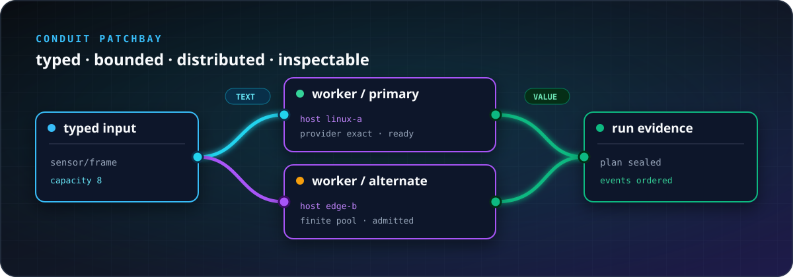

<p align="center">
  
</p>

<h1 align="center">Conduit</h1>

<p align="center">
  <strong>Wire software and hardware into distributed, redundant systems you can see.</strong>
</p>

<p align="center">
  <a href="https://dancxjo.github.io/conduit/tour/public/#workspace"><strong>Open the interactive Patchbay Tour →</strong></a>
  ·
  <a href="docs/capability-matrix.md">Current capabilities</a>
  ·
  <a href="docs/safety-and-stewardship.md">Safety boundary</a>
</p>

Conduit is a Rust-first composition and execution system. You connect typed
nodes with bounded cords in a `.panel` file; Conduit checks the arrangement,
chooses exact implementations and hosts, runs it, and records what happened.

One model can span a command-line program, browser worker, Linux host, remote
service, or small embedded device. The Patchbay gives that model visual
controls without making the UI the source of truth.

## Why Conduit?

- **See the whole system.** Source, topology, placement, queue pressure, and
  run evidence meet in one inspectable patchbay.
- **Place work across unlike machines.** A node describes what it means;
  providers describe how and where it can run.
- **Design redundancy explicitly.** Finite replicated pools, bounded failure
  behavior, and exact replacement plans make alternatives part of the system
  rather than hidden glue.
- **Know what will run before it runs.** Plans pin implementations, artifacts,
  hosts, resources, authority, and budgets.
- **Keep flow bounded.** Every live cord declares finite storage and a pressure
  policy; cancellation and terminal behavior are deterministic.
- **Reach small hardware.** The semantic core is allocator-free and
  `#![no_std]`-capable.

Speech pipelines, robots, web services, sensor networks, and data workflows can
share the same small vocabulary:

| Part | Meaning |
|---|---|
| **node** | a typed computation or capability |
| **port** | a node's directional boundary |
| **cord** | a bounded connection between ports |
| **panel** | editable source that arranges nodes and cords |

Panels can expose ports of their own, so an entire arrangement becomes another
reusable node.

## Try the Patchbay

The [interactive Tour](https://dancxjo.github.io/conduit/tour/public/#workspace)
lets you edit real `.panel` source, move through its visual topology, check
types, run supported examples in a browser worker, and inspect the resulting
plan and evidence.

To use the CLI from this repository:

```sh
cargo run -p conduct -- examples/hello.panel
cargo run -p conduct -- --check examples/hello.panel
cargo run -p conduct -- --explain examples/hello.panel
```

Primary values stay on stdout; diagnostics and status stay on stderr, so
`conduct` remains friendly to ordinary Unix pipes.

For an exact run that stays alive between inputs, timers, or host operations,
see [hosted exact-run sessions](docs/exact-run-sessions.md). It explains the
difference between an editable blueprint, one pinned active run, Waiting,
Drain, and Abort. The Tour's live ticker shows a public latest value changing
in one browser-worker run; its HTTP service lesson uses the same checked
listener source as the hosted multi-request proof and reports the unavailable
browser provider instead of simulating a server.

## What exists today

Conduit is pre-release research software. The repository currently proves:

- typed panel parsing, exact planning, and bounded execution;
- the same pure-node execution contract in the CLI and browser worker;
- an authoritative Patchbay projection with typed editing intents;
- bounded loopback HTTP serving;
- executable Zenoh loopback transport semantics;
- deterministic packaging, inspection, and typed run evidence.

The [mechanically checked capability matrix](docs/capability-matrix.md) is the
source for current claims. Contracts, providers, host support, runtime proof,
and product presentation are tracked separately.

Conduit does **not** yet promise production high availability, hostile
multi-tenant isolation, autonomous fleet enrollment, safe public-Internet
deployment, or hazardous physical control. Keep experiments controlled and
read the [safety and stewardship boundary](docs/safety-and-stewardship.md)
before consequential use.

## How execution fits together

```text
.panel source
    → parse and type-check
    → resolve providers, hosts, authority, and budgets
    → seal an exact plan
    → execute with bounded cords
    → emit typed evidence
    → project into the Patchbay
```

The presentation can fail while the headless system keeps its meaning. A
screenshot, a green check, or a signed artifact is never promoted into a claim
it cannot support.

## Development

```sh
cargo fmt --check
cargo clippy --workspace --all-targets -- -D warnings
cargo test --workspace
cargo xtask verify-canonical
cargo check -p conduit-core --no-default-features \
  --target thumbv6m-none-eabi
```

Start with the [roadmap](spec/002-roadmap.md), browse the
[examples](examples/), or pick up an [open issue](https://github.com/dancxjo/conduit/issues).

MIT licensed.
