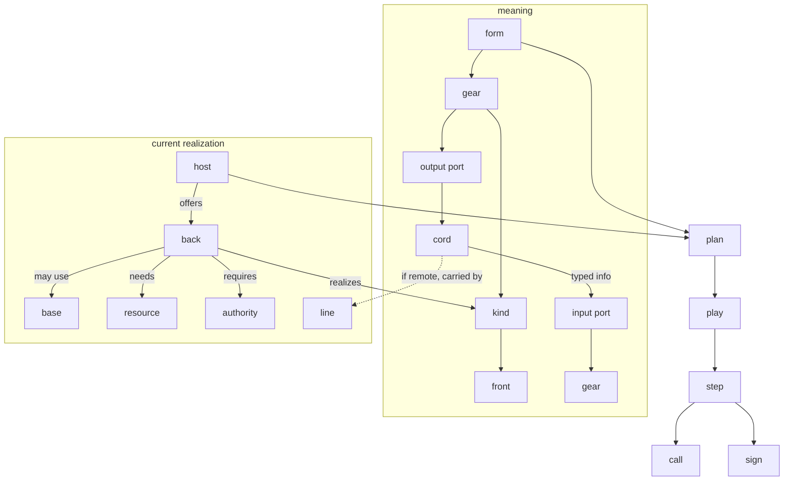
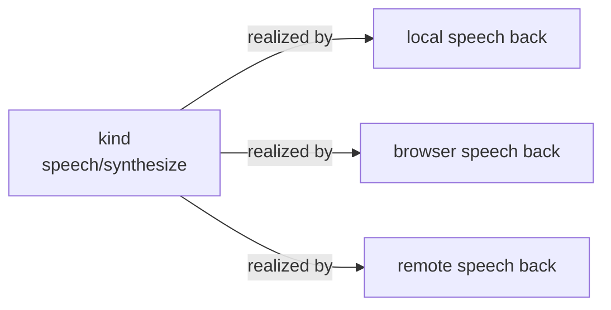
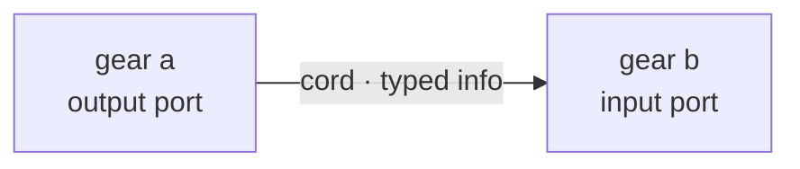
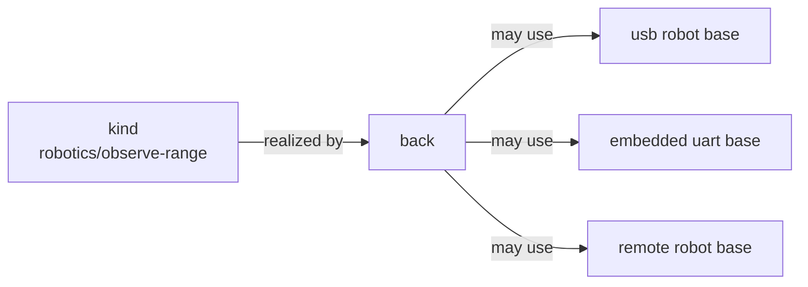
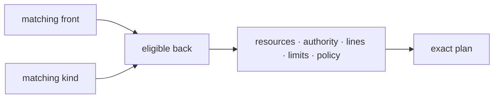
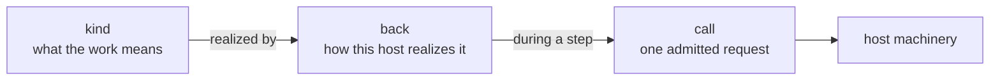
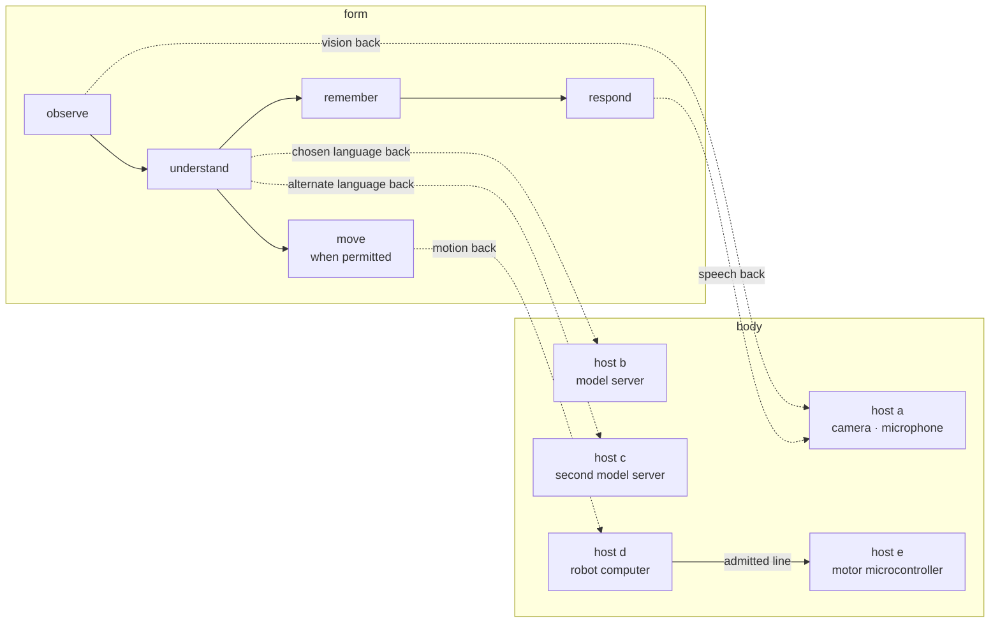

# Conduit

**One continuing computer, made from the computers you have.**

Conduit is a programming system for describing work independently of the particular machines that perform it.

A Conduit **body** may live entirely on one computer, or span a laptop, browser, server, microcontroller, robot, and other machines. Its programs describe what should happen. Conduit examines the machinery that is actually available, chooses an exact way to realize that work, and runs it through one common execution model.

```conduit
form hello {
    upper: text/upper
    show: presentation/text

    "Hello, world." >> upper >> show
}
```

This form says:

1. produce some text;
2. turn it into uppercase;
3. present it.

It does not say whether the work must run on Linux, in a browser, under ConduitOS, or across several hosts. It does not name a display, process, socket, device path, or transport.

Those choices belong to realization.

> **[See ConduitOS running through the current illustrated journey](https://dancxjo.github.io/conduit/current/conduitos/x86_64/)**

**[Try the Tour](https://dancxjo.github.io/conduit/tour/)** ·
**[Current status](STATUS.md)** ·
**[Architecture](docs/conduit-canon.md)** ·
**[Contributing](CONTRIBUTING.md)**

---

## The basic idea

A Conduit program is a **form**.

A form contains **gears**. Each gear asks for a **kind** of work.

A kind has a **front**, which describes how that kind is used. A **back** is one concrete way to realize that kind.

Gears have typed **ports**. **Cords** connect compatible ports and carry **info**.

A running **host** offers backs. A host may use **bases** to reach devices, services, networks, displays, clocks, files, or other external machinery. Backs may also require finite **resources** and explicit **authority**.

When a cord crosses between hosts, a **line** carries its traffic.

The planner combines the form with current host truth and creates an exact **plan**. One execution of that plan is a **play**.

During a play, the kernel advances work in bounded **steps**. A step may make a **call** into host machinery. **Signs** record what actually happened.

Put together:



These words are ordinary common nouns. They describe different parts of the system and are meant to stay different.

---

## Kinds describe meaning

A **kind** says what a piece of work means.

For example, `text/upper` means that text is transformed to uppercase.

Another kind, `text/redact`, might expose exactly the same front, `text → text`, while meaning something quite different.

Conduit therefore separates two questions:

> **Can I call this thing the same way?**

from:

> **Does this thing mean the same thing?**

The first question is answered by the **front**.

The second is answered by the **kind**.

Two things may have the same front without being interchangeable.

Conversely, several very different backs may realize the same kind.

That distinction is central to Conduit.

---

## Fronts describe how something is used

A **front** is the checked callable boundary of a kind or form.

It includes facts such as:

* startup parameters;
* input ports;
* output ports;
* the type of info carried through each port;
* temporal behavior;
* shorthand paths where one is defined.

A front does not describe the machine that will perform the work.

For example, the same speech-synthesis kind might be realized by:

* a native speech engine;
* a browser facility;
* a remote model;
* another Conduit form.

If those backs faithfully realize the same kind and expose the same front, the planner may consider them as alternatives.

The front says **how to call it**.

The kind says **what it means**.

---

## Backs describe how a kind can be realized

A **back** is one concrete realization of a kind.

A back may be:

* native code;
* browser or WebAssembly code;
* embedded firmware;
* a remote service;
* another form;
* some other finite implementation admitted by a host.

A back carries realization facts such as:

* implementation identity;
* exact artifact identity;
* host calls it requires;
* resources it needs;
* authority it requires;
* finite capacities it can actually support.

A back does not redefine the kind it realizes.

This lets Conduit keep meaning portable while keeping execution exact.

For example:



The implementations differ. The semantic promise does not.

---

## Forms compose kinds

A **form** is an authored composition of semantic work.

It contains configured gears and cords between their ports.

A form may also expose its own front and become a back for a larger kind.

That gives Conduit recursive composition without inventing a second programming model.

A small form:

```conduit
form loud {
    upper: text/upper
    show: presentation/text

    "Hello." >> upper >> show
}
```

can itself become part of a larger form.

Internally it may contain several gears. Externally it can present one checked front.

The internal graph remains part of its exact realization without leaking platform details into callers.

---

## Gears are occurrences of kinds

A **gear** is one configured occurrence of a kind inside a form.

If a form uses `text/upper` twice, those are two gears even though they request the same kind.

A gear has its own identity within the form.

For example:

```conduit
form compare {
    title: text/upper
    label: text/upper
}
```

`title` and `label` are different gears.

Both request the same kind.

The distinction matters for configuration, placement, planning, execution, signs, and inspection.

---

## Ports, cords, and info

A **port** is a typed directional boundary on a gear.

An input port receives info.

An output port produces info.

A **cord** connects compatible ports.



Cords carry **info**.

Info is finite typed data. It may be simple:

* a boolean;
* a count;
* text;
* a scalar;
* a physical quantity;

or structured:

* an observation;
* a message;
* a robot pose;
* a model request;
* a table;
* a bounded sequence.

Info is not a pointer into another machine.

It is semantic data whose representation and limits are known.

---

## State carries info through time

A cord connects work across space in a graph.

**State** carries selected info across an explicit boundary in time.

State is not the same thing as persistence.

A form may retain current state without writing anything to durable storage.

Likewise, storing a resource does not automatically make it semantic state.

Conduit keeps these ideas separate because their lifetimes and obligations are different:

| noun | meaning |
|---|---|
| **info** | a finite typed value |
| **state** | evolving info retained across an explicit time boundary |
| **resource** | bounded addressable content with its own lifecycle |
| **record** | retained historical evidence |

There is intentionally no magical universal `save` operation hiding those distinctions.

---

## Hosts are places where work can run

A **host** is a running software environment that participates in Conduit.

Examples include:

* a normal desktop process;
* a browser;
* ConduitOS;
* a microcontroller;
* an embedded computer;
* a remote machine.

A host reports what it can currently offer.

That includes facts such as:

* its identity;
* its current **boot**;
* available backs;
* ready bases;
* resources;
* finite limits;
* current observations.

A **boot** is one exact incarnation of a host.

A host may retain its durable identity across restarts while each restart receives a new boot identity.

That lets Conduit distinguish:

> “this is still the same host”

from:

> “this is definitely not the same running incarnation I planned against.”

Stale boot truth fails closed.

---

## Bases connect Conduit to concrete reality

A **base** is the last trusted Conduit seam for one bounded family of external machinery.

A base might provide access to:

* a display;
* a timer;
* a serial controller;
* a network stack;
* a camera;
* an audio device;
* a filesystem boundary;
* a robot;
* an external service.

The kind remains semantic.

The base remains concrete.

For example:



The form asks for the observation.

It does not need to encode how the sensor is physically attached.

Bases have exact provider identity and generation. If the provider is replaced or restarted, stale plans cannot quietly continue using yesterday's machinery.

Discovery means that something exists.

It does not grant authority to use it.

---

## Resources are finite and explicit

Some backs need more than typed input values.

They may need a **resource**.

Examples include:

* an image;
* a file;
* a camera stream;
* a model slot;
* a block of memory;
* an audio surface;
* stored content.

Resources have explicit:

* identity;
* lifetime;
* capacity;
* sharing rules;
* generation;
* residence.

A resource reference may travel as info, but the reference does not itself grant authority.

That distinction matters in distributed systems.

Knowing where something is is not permission to use it.

---

## Authority is separate from availability

Conduit keeps several facts separate:

| fact | what it says |
|---|---|
| **available** | the machinery exists and is currently usable |
| **authorized** | the required authority has been admitted |
| **selected** | an exact plan chose it |
| **active** | a play is actually using it |

None of these facts implies the next.

A device may exist without being authorized.

A host may advertise a back without the current work being allowed to use it.

A resource may be free without a play having permission to modify it.

Authority is admitted explicitly and may be enforced by different mechanisms depending on the host and base.

Conduit does not collapse those mechanisms into one vague `secure` flag.

A cooperative process, a restricted subprocess, a browser permission boundary, an operating-system capability, and a hardware gate are different things and remain different facts.

---

## Lines carry cords between hosts

A **cord** is part of the semantic graph.

A **line** is machinery that carries a cord between hosts.

That distinction lets forms remain independent of transport.

A line may use:

* a local socket;
* usb;
* bluetooth;
* a protected websocket;
* a local network;
* WebRTC;
* another admitted carrier.

The form does not say `send this value over websocket` unless websocket itself is the intended meaning.

It says, in effect, `connect these ports`.

Planning determines how that cord can actually be carried.

A line is finite and exact. Its identity, endpoints, pressure behavior, protection, and current availability can become plan truth.

If a line disappears, Conduit does not silently invent another network path.

A pre-admitted alternative may be used where the plan allows it, or the body may make a new plan.

---

## Planning makes realization exact

A checked form describes meaning.

Hosts describe current reality.

Planning joins them.

The planner begins by admitting only backs that match both the required front and the required kind:



Then it considers additional facts:

* host availability;
* bases;
* resources;
* authority;
* line availability;
* finite queue and memory limits;
* current observations;
* explicit planning policy.

Only semantically valid backs reach policy selection.

A cheaper implementation of the wrong kind is not a candidate.

Once the planner chooses, it produces an immutable **plan**.

A plan may bind:

* each gear to an exact host and boot;
* an exact back;
* an exact implementation and artifact;
* bases and provider generations;
* resources;
* authority;
* lines;
* queue bounds;
* expected signs;
* execution limits.

A plan is not execution.

It is the exact admitted description of execution.

---

## A play runs a plan

A **play** is one active execution of a plan.

The distinction matters.

The same plan may be played more than once, and each play has its own history and evidence.

During a play, one shared kernel coordinates execution.

The kernel does not rediscover the graph, choose new implementations, or acquire ambient authority while running.

Those decisions belong before execution or to an explicit new planning pass.

---

## Steps advance execution

Execution proceeds through bounded **steps**.

A step may:

* consume input;
* emit output;
* wait;
* complete;
* fail;
* make a host call.

Each step is admitted under finite limits.

This matters on a large desktop machine, but it matters even more when the same execution model must also run on constrained devices.

Conduit does not treat an unlimited queue, retry loop, background task, or hidden allocation as harmless implementation detail.

Finite embodiment is part of the execution contract.

---

## Calls cross into host machinery

Sometimes a back needs concrete work from its host.

A **call** crosses that boundary.

Examples include:

* wait on a clock;
* present a value;
* read from an admitted device;
* send bytes;
* write a resource;
* invoke a hardware effect.

The kernel controls execution and correlation.

The host performs the admitted call and returns its outcome.

That prevents the platform adapter from quietly becoming a second scheduler.

The difference is useful:



---

## Signs are evidence, not authority

A **sign** records something that happened during planning or execution.

Signs can preserve facts such as:

* what was selected;
* what was prepared;
* what completed;
* what failed;
* what effect was attempted;
* which play produced the evidence.

A sign does not grant permission.

It does not make an implementation safe.

It does not turn an inference into an observation.

It is evidence about an event in the system.

That distinction is important enough that Conduit keeps different proof classes separate.

A passing unit test, browser execution, emulator boot, physical hardware run, and attended human test do not establish the same thing.

See [STATUS.md](STATUS.md) for the current evidence boundary.

---

## Bodies continue while machinery changes

A **body** is the durable logical computer Conduit is assembling.

A body may have one host or many.

Hosts may disappear and return.

Machines may be replaced.

A model may move from one computer to another.

A line may fail.

A new plan may redistribute work.

The body can remain the same body through those changes.

A **part** is a durable membership relationship within a body.

A part is not the same thing as a current host or boot.

That distinction allows the body to remember:

> this machine belongs here

even while also knowing:

> its current boot is gone.

Connectivity, membership, trust, authority, and placement remain separate facts.

---

## A body has a face

A **face** is the semantic presentation surface of a body.

It is not the same thing as a front.

A front belongs to callable semantic work.

A face belongs to presentation of the body as a whole.

The body may manifest its face through:

* a browser;
* a native window;
* ConduitOS;
* a small display;
* speech;
* another appropriate presenter.

The manifestation can change without changing what the body is presenting.

Patchbay is likewise a projection over actual body and execution truth. It does not become a second runtime merely because it can display or edit that truth.

---

## One body, many machines

Consider a small robot body. Its form describes semantic work while the current plan places that work across several hosts:



Remote cords cross admitted lines between those hosts.

Motion eventually reaches an admitted robot base.

If host b becomes overloaded or disappears, another back on host c may realize the same language kind.

A new plan can select it.

The form did not change.

The kind did not change.

The front did not change.

The back did.

That is the heart of Conduit:

> **meaning is portable; realization is exact.**

---

## What Conduit does not hide

Conduit deliberately keeps several distinctions visible.

### Meaning is not mechanism

A kind does not become a usb kind because its first implementation happened to use usb.

### Reachability is not membership

Finding another host on a network does not make it part of a body.

### Membership is not authority

A member of a body is not automatically allowed to perform every effect.

### Availability is not selection

An advertised back is only a candidate until a plan chooses it.

### Selection is not execution

A plan does not become active merely because it exists.

### A cord is not a line

The cord belongs to meaning and composition.

The line belongs to realization.

### A front is not a face

A front is callable.

A face is presentational.

### A sign is not permission

Evidence and authority are different kinds of truth.

---

## Trying Conduit

You need Git and Rust installed through `rustup`.

```sh
git clone --branch dev https://github.com/dancxjo/conduit.git
cd conduit
cargo xtask host std
```

That builds and runs the local example through the repository development tooling.

For the browser Tour, install Node.js and npm and add the WebAssembly target:

```sh
rustup target add wasm32-unknown-unknown
cargo xtask demo tour
```

To inspect your environment:

```sh
cargo xtask doctor
```

The repository uses `cargo xtask` for development and proof workflows.

`conduit` is the installed product command.

See [Try Conduit](docs/try-conduit.md) for additional examples and [the target guides](targets/README.md) for platform-specific work.

---

## Exploring the system

### Tour

Tour teaches Conduit through running examples.

**[Open Tour](https://dancxjo.github.io/conduit/tour/)**

### Patchbay

Patchbay lets you inspect forms, gears, cords, plans, plays, hosts, and other current body truth.

See [the Patchbay guide](products/patchbay/README.md).

### ConduitOS

ConduitOS runs the same architectural model in a freestanding environment rather than treating the operating system as a special second runtime.

**[View the current x86_64 journey](https://dancxjo.github.io/conduit/current/conduitos/x86_64/)**

See [the ConduitOS guide](targets/conduitos/README.md) for build and boot instructions.

### Crèche

Crèche is the birth process for a body: choosing initial work, preparing machinery, and creating the first durable body truth.

It belongs to the body's lifecycle, not to a separate execution model.

---

## Digging into the architecture

A few rules explain a great deal of the repository.

### Forms contain no realization facts

A normal form does not name:

* a host;
* a boot;
* an implementation;
* an artifact;
* a network address;
* a device path;
* a resource handle;
* a credential;
* an authority grant.

Those facts belong to realization and planning.

### Hosts advertise current truth

A host does not promise everything its source tree knows how to compile.

It advertises only what its current boot and ready bases can actually offer.

### Plans are immutable

If important reality changes, Conduit makes another plan.

It does not quietly mutate the meaning of an existing plan.

### Execution is bounded before play

Queues, values, bytes, resources, calls, signs, and mandatory work are admitted under finite limits before hot execution depends on them.

### There is one kernel

Hosted Rust, browsers, constrained devices, and ConduitOS share the same execution model.

A target adapter may provide machinery.

It may not invent another scheduler.

### Failure is truth

Disconnects, stale boots, missing resources, denied authority, exhausted bounds, malformed values, and unsupported behavior remain distinguishable.

Automatic retry is a semantic promise. A base or host may not invent it behind the plan.

---

## Repository guide

The repository is organized around the same boundaries:

| path | responsibility |
|---|---|
| `architecture/` | core identities and contracts, form checking and expansion, planning, and kernel execution |
| `semantics/` | kinds, info types, and domain meaning |
| `forms/` | reusable authored compositions |
| `targets/` | hosts, bases, fabrication, and platform realization |
| `bodies/` | complete durable body compositions such as Pete |
| `products/` | user-facing tools and projections such as Patchbay |
| `proof/` | executable evidence and conformance work |
| `docs/` | architecture, guides, evidence, and history |

If code that defines portable meaning starts depending on browser, Linux, usb, or a specific robot, it is probably in the wrong layer.

If platform code starts redefining the meaning or front of a kind, it is probably in the wrong layer.

That rule catches a surprising number of architectural mistakes.

---

## Project status

Conduit is experimental software, but substantial parts of the architecture are executable today.

The development tree includes:

* checked `.conduit` forms;
* recursive forms through fronts and backs;
* typed info and structured values;
* immutable planning;
* bounded execution through one kernel;
* host and base composition;
* browser and native hosts;
* ConduitOS targets;
* distributed cords over admitted lines;
* protected network paths;
* embedded and physical-device work;
* explicit authority and resource admission;
* body membership and continuity;
* evidence through correlated signs.

Not every implementation has the same level of proof.

In particular, source support, deterministic tests, browser execution, emulator execution, live transport, physical hardware, attended human use, and released-product proof are intentionally different claims.

See [STATUS.md](STATUS.md) for the current boundary and [the roadmap](docs/roadmap.md) for unfinished work.

---

## Contributing

Conduit is large enough that the easiest contribution is usually not “understand all of Conduit first.”

Run something.

Find one behavior you can explain.

Improve it without weakening the surrounding distinctions.

The most important architectural habit is simple:

> Put meaning with kinds and forms.
> Put machinery with backs, hosts, and bases.
> Let plans join the two explicitly.

See [CONTRIBUTING.md](CONTRIBUTING.md) for setup, repository conventions, and pull-request guidance.

---

## In one paragraph

A form contains gears that ask for kinds. A kind says what work means, and its front says how that work can be used. Ports connect through cords carrying typed info. Hosts offer backs that realize kinds, using bases, resources, and explicitly admitted authority. Lines carry remote cords between hosts. The planner turns the form and current host truth into an exact immutable plan. A play runs that plan through bounded steps, which may make calls into host machinery. Signs record what happened. State carries selected info through time. Hosts and boots may come and go while their parts remain members of one continuing body, and that body presents itself through its face.

**Meaning stays portable. Realization stays exact.**
