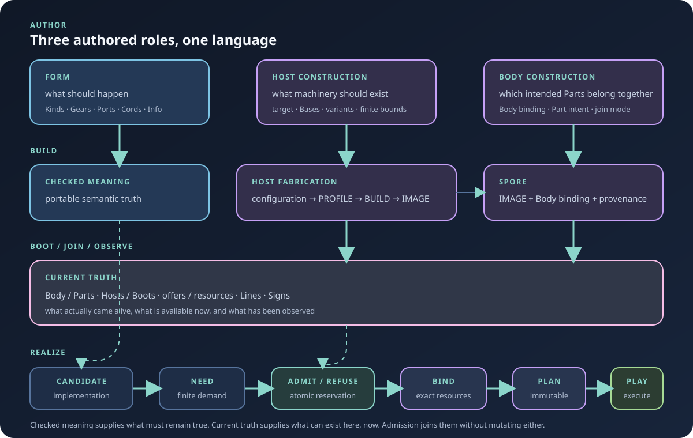

# Conduit

**The body is the computer.**

Conduit is an experimental programming system for building one computer out of the computers you actually have.

You describe **what should happen** in a portable **form**. Separately, body building prepares the parts that may embody it: Linux machines, browsers, ConduitOS systems, microcontrollers, and other hosts. Each intended host can be built into a deployable spore. When those spores boot and join, Conduit sees the current body that actually came alive.

Conduit then finds a finite realization of the form that fits that body now. It seals that realization into an immutable **plan** and executes the plan as a **play**. If the world changes, the meaning does not have to change with it. A different collection of hosts, a failed line, a busy processor, or a smaller machine may simply require a different plan.

> **You describe the meaning. You build the body. Conduit works out how that body can make the meaning real now.**



## Try the smallest thing

A Conduit program is a graph of semantic operations, not a script that names the machine that will run it.

```conduit
form hello {
    upper: text/upper
    show: presentation/text

    "Hello, world." > upper > show
}
```

Run it with:

```sh
conduit run examples/hello.conduit
```

The form asks for uppercase text and presentation. It does **not** ask for stdout, Linux, a browser, a process, a particular CPU, or a particular transport. Those are realization facts.

To look at the same system visually:

```sh
conduit patchbay --on native
```

From a source checkout, `just patchbay` is the friendly repository entrance.

## Why Conduit exists

Conduit is trying to make several awkward facts about real computers ordinary rather than exceptional.

- **One program can span unlike machines.** A laptop can handle presentation and human input while another host does heavy compute and a microcontroller handles physical I/O. The form does not need to become three platform-specific programs just because the realization crosses machine boundaries.
- **The whole body can be more useful than any one machine.** A weak computer is not globally obsolete because one workload no longer fits. It may remain the best place for a display, keyboard, network interface, sensor, or other compatible work.
- **Current load matters.** A nominally powerful host may be heavily burdened while a smaller host is mostly idle. Scheduling should care about what can actually be admitted now, not merely which machine looks strongest on paper.
- **Tiny hosts can stay tiny.** A constrained MCU should receive only the finite fragment it has been assigned. It need not store, understand, or schedule the whole body.
- **Failure need not rewrite meaning.** If a line disappears or a host leaves, an immutable plan may already contain an admitted alternative, or Conduit can make a fresh plan from new truth. The form and body can remain the same.
- **Local models are ordinary work.** An LLM implementation is one possible realization of a semantic gear. It consumes finite resources, competes with other work, can disappear, and can be placed elsewhere without becoming a privileged AI subsystem.

That is the forest. The rest of the architecture exists to make those statements precise.

## The model

### A form is meaning

A form describes semantic composition. Most executable meaning is built from a small set of concepts:

| Concept | Meaning |
|---|---|
| **kind** | Reusable semantic behavior and its checked contract |
| **gear** | One configured occurrence of a kind in a form |
| **port** | Exact typed directional semantic point with a temporal contract |
| **cord** | Typed semantic connection between compatible ports |
| **info** | Shaped typed data carried through a cord |

A **face** is the stable contract visible to surrounding meaning. A **back** is another form that implements that face using more Conduit meaning. Recursive composition can therefore continue until the remaining leaves are operations some current host can directly realize.

A form is deliberately ignorant of placement. Host names, operating systems, processor counts, transport mechanisms, provider names, and transient load do not belong in ordinary semantic source merely to obtain execution.

### The body is the computer

A **body** is the durable computer assembled from the parts Conduit can use to maintain some intended world. A body may have one part or many. Its parts may be backed by very different machines.

A **host** is one exact running environment that truthfully offers finite realizations and resources. A **boot** identifies one current incarnation of that host. A durable part can remain part of the body even while its current host or boot is absent.

This distinction lets the body survive changes in machinery. The workstation can reboot. A browser page can disappear. A Pico can go offline. None of those events necessarily means the body itself ceased to exist.

### A plan is one exact answer

A **plan** records one exact finite answer to the question: *how can this form be realized by this current body?*

The plan seals implementation choices, placements, resource bindings, authority, cord realizations, lines, limits, and the exact host/boot identities that matter to that realization. A **play** is the active execution of one plan.

Plans are immutable. New signs may make an old plan unsatisfied, but they do not edit it. If the world has changed enough to require another realization, Conduit creates another plan.


A **wake** is one interval in which Conduit actively maintains a body's obligations. A **lull** ends that interval without deleting the body. One wake may therefore contain several successive plans and plays as current truth changes.

## Body building

Body building prepares the machinery intended to participate in a body.

A checked `*.body.conduit` document describes the intended parts and references reusable `*.host.conduit` construction documents. Each host construction selects a target, bases, implementation variants, and finite structural bounds. The existing fabrication path checks that construction, resolves a profile, performs a build, and produces an image. Body binding then packages that image as a spore for one intended part or bounded self-joining flow.

A spore is **not** a host and it is **not** a boot. It is prepared machinery plus enough body-directed binding and provenance to become useful after launch, boot, load, or flash. Building or deploying a spore does not manufacture current presence, current offers, lines, plans, plays, or runtime authority.

The repository includes a checked multi-host example:

```sh
cargo xtask body check profiles/bodies/pete-r1.body.conduit
cargo xtask body show profiles/bodies/pete-r1.body.conduit
cargo xtask body build profiles/bodies/pete-r1.body.conduit
```

See [Body building and spores](docs/body-building.md) for the exact artifact and deployment boundaries.

## One Conduit language

Forms, host construction, and body construction are different document roles, not different little languages.

Canonical source uses one tokenizer, value syntax, declaration machinery, span model, and diagnostic system. Files such as `examples/hello.conduit`, `profiles/host-configurations/linux-workstation.host.conduit`, and `profiles/bodies/pete-r1.body.conduit` describe different things but belong to the same Conduit language.

The language stays intentionally small. New architectural concepts should extend the common grammar only when necessary; they should not sprout a YAML, TOML, JSON, or ad hoc mini-language merely because a new subsystem needs configuration.

For form source, the central relations remain simple: `:` associates a named gear with a kind or form, `=` expresses an immutable declarative value relationship, and `>` expresses runtime flow. Faces use `(...)`; backs use `{...}`.

See [the Conduit canon](docs/conduit-canon.md) and [runnable form examples](docs/try-forms.md) for the language rather than treating this README as a full reference manual.

## Scheduling finite resources

Real machines are finite, and their current state changes. Conduit treats that as useful truth rather than something to hide behind an unbounded queue.

An implementation has a **need**: the finite resources required by one candidate realization. A host has stable **offers**: the capacities and mechanisms it can provide. Current **observations** say what is free, busy, ready, unavailable, or expensive now. The resource owner then **admits** the need or refuses it atomically.

Those are ordinary scheduling words, not another layer of ceremonial vocabulary.

The distinction matters. A host might have 32 processor lanes in total but only five currently unreserved. A model realization that can use between two and sixteen lanes may still run there, just more slowly than preferred. Another realization that requires at least six lanes must be refused until current truth changes.

The same law applies across machines and inside one machine. Choosing between two hosts for model inference and choosing whether a new play fits beside several existing plays on one multicore processor are the same resource-admission problem at different scopes.

Admission and selection are also different questions. Hard requirements determine whether a candidate can run at all. Policy compares only the candidates that remain admissible. Current throughput, latency, queue pressure, memory pressure, transport cost, and locality may influence that comparison, but a favorable score can never resurrect an impossible realization.

The more explicit atomic admission work is tracked in [#1751](https://github.com/dancxjo/conduit/issues/1751). The stable resource contracts, scalable compute requirements, current resource observations, and locality cost machinery already exist and are being pulled back toward this simpler center.

## Hosts, bases, lines, and signs

These concepts describe current realization rather than authored meaning:

| Concept | Responsibility |
|---|---|
| **host** | Truthfully offers finite implementations, resources, and limits for one exact running environment |
| **boot** | Identifies one current incarnation of a host |
| **base** | Platform or machine mechanism beneath host offers |
| **line** | One exact finite connectivity realization used by a plan and play |
| **sign** | Bounded machine-readable truth about what is true or what happened |

A base is not a kind. A line is not a cord. Hardware existence does not automatically become a host offer. Reachability is not membership, membership is not trust, and availability is not authority.

This separation is what allows a semantic cord to survive a transport change, a part to survive a boot change, and a form to survive a placement change.


## What runs today

Conduit is still experimental, but the repository proves real execution across materially different environments. The authoritative claim boundary is [STATUS.md](STATUS.md); the README only gives the shape.

Current accepted work includes:

- canonical `.conduit` forms with checked and expanded semantic identity;
- one finite, port-aware `conduit-kernel` used across production paths;
- native std execution and real Rust/WASM browser hosts;
- bounded live WebSocket and USB CDC lines;
- physical Pico W execution with correlated sign receipts;
- multi-part body membership and offline/current-presence distinctions;
- exact replan versus same-plan line recovery semantics;
- ConduitOS image, boot, input, and execution work across several architecture profiles;
- native and browser Patchbay manifestations driven by authoritative semantic and runtime state;
- checked host fabrication and canonical host construction source;
- body building that composes checked host construction into body-bound spores;
- typed local-model and LLM realizations with finite model, queue, context, memory, and provider lifecycle limits.

These proofs do not collapse into one vague "works" badge. A build is not a boot. A browser compile is not a browser run. A generated firmware image is not a physical board transcript.


Read [STATUS.md](STATUS.md) before making a capability claim.

## Try more

Check local prerequisites with:

```sh
cargo xtask doctor
```

Open Patchbay:

```sh
conduit patchbay --on native
conduit patchbay --on browser
```

Start an independent browser host:

```sh
cargo xtask doctor browser
cargo xtask host browser
```

Run the x86-64 ConduitOS demo in QEMU:

```sh
cargo xtask conduitos demo --arch x86-64
```

Machine-oriented ConduitOS checks remain separate:

```sh
cargo xtask conduitos run --arch x86-64
cargo xtask conduitos prove --arch x86-64
```

Physical Pico work is intentionally hardware-gated:

```sh
cargo xtask doctor pico
cargo xtask prove std-pico-usb --interactive
```

See [Try Conduit](docs/try-conduit.md) for the guided executable tour and [STATUS.md](STATUS.md) for exact prerequisites and proof scope.

## Boundedness is architecture

Every admitted play has finite truth for the resources it can consume: operations, queues, bytes, values, memory, compute, model slots, line/session capacity, evidence retention, authority, protected resources, and mandatory work.

Pressure, exhaustion, cancellation, provider loss, stale identity, unsupported behavior, and failure remain explicit outcomes. Conduit does not quietly turn them into unbounded buffering, hidden retries, or mutable plan surgery.

This is what lets the same semantics remain meaningful on a workstation, browser, microcontroller, or body made from all three.

## Repository map

| Path | Responsibility |
|---|---|
| `architecture/` | Universal Form, Body, Plan, Play, planner, kernel, wire, and authoritative projection substrate |
| `semantics/` | Host-neutral semantic Kinds, values, contracts, and domain algorithms |
| `fabrication/` | Generic Host, Body, workspace, and fixed-build construction machinery; fabrication remains inert before boot |
| `targets/` | Exact hosted, browser, ConduitOS, board-family, firmware-product, machine, build, and boot realizations |
| `mechanisms/` | Reusable device protocols and implementation mechanics below semantic and Host composition |
| `apps/` | Product and application compositions, including the `conduit` CLI, Patchbay, and Pete |
| `proof/` | Conformance packages, browser evidence, and deterministic fixtures fenced from production truth |
| `profiles/` | Checked host and body construction source |
| `examples/` | Canonical executable forms |
| `xtask/` | Repository development, fabrication, proof, doctor, and hardware workflows |
| `tools/` | Narrow tooling support used by repository-development entrances |
| `docs/` | Canon, architecture, runnable guides, truth boundaries, and design history |
| `assets/` | README and presentation assets |

Add a new semantic Kind under `semantics/`; an exact Host, board, or machine
target under `targets/`; a reusable device or protocol under `mechanisms/`; a
product composition under `apps/`; and conformance-only material under
`proof/`. A directory states ownership, while a crate states the dependency
boundary. Sharing a CPU architecture does not merge exact machine, board,
firmware, boot, artifact, or proof identities.

If you are new to the codebase, start with `conduit run examples/hello.conduit`, then open Patchbay, follow [Try Conduit](docs/try-conduit.md), and read [the Conduit canon](docs/conduit-canon.md). Read [AGENTS.md](AGENTS.md) before changing architecture.

## Design rules worth remembering

- **The body is the computer.** A machine is one possible part of a larger realization, not the universal boundary of computation.
- **There is one Conduit language.** Different authored roles do not get independent DSLs.
- **Programs are graphs, not scripts.** Source order does not secretly become execution order.
- **Meaning is not placement.** Forms do not name machines, providers, or transports merely to obtain execution.
- **Kinds are not gears.** Reusable behavior and configured occurrence remain distinct.
- **Faces are not implementations.** A back expresses more meaning; a host offers concrete realization.
- **Body building prepares spores; it does not create runtime truth.** A spore is not a host or boot.
- **A plan is exact and immutable.** New truth may require another plan but never repairs the old one in place.
- **A line is not a cord.** Connectivity can change without changing semantic graph identity.
- **Availability is not authority.** Reachability, membership, trust, and permission remain separate.
- **Boundedness is part of correctness.** Finite resources and explicit pressure are architectural facts.
- **There is one execution kernel.** Renderers, model providers, firmware adapters, and fixtures do not acquire private runtimes.
- **Proof classes do not collapse.** Compile, simulation, hosted execution, browser execution, transport, firmware, and physical evidence say different things.

## Contributing

Read [AGENTS.md](AGENTS.md) before substantial work. The primary repository gate is:

```sh
cargo xtask check
```

Public executable workflows belong under `conduit`. Repository development, fabrication, demonstrations, hardware work, and proof belong under `cargo xtask`. `just` is a thin convenience layer and should own no independent behavior.

## In one sentence

**Conduit lets you describe what should happen, build a body from the computers you have, and truthfully realize that meaning across whatever parts can actually make it happen now.**
