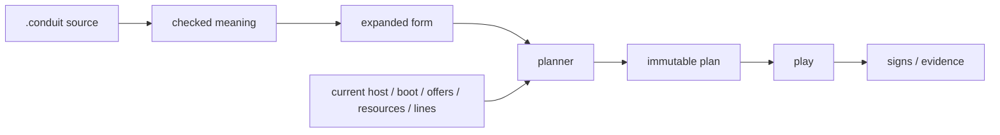

# Architecture tour

Conduit has one recurring move:

> **separate semantic meaning from concrete realization, then join them explicitly in a plan.**

## From source to execution



A source file is not a plan. A plan is not execution. Evidence is not authority.

Those separations are intentional.

## Semantic graph

A form contains gears.

```conduit
form hello {
    upper: text/upper
    show: presentation/text

    "Hello, world." >> upper >> show
}.
```

The graph can be summarized as:

```text
literal -> text/upper -> presentation/text
```

Each gear invokes a **kind** through a checked **fore**. Each fore has typed directional **ports**. **Cords** connect compatible ports and carry **info**.

## Realization

A host offers **backs**, concrete realizations of semantic kinds.

For the same `presentation/text` meaning, one host might offer a native graphical back, another a browser back, another a spoken path, and a headless host none at all.

The planner considers only semantically eligible backs and then checks current facts such as:

- host and boot identity;
- bases and initialized machinery;
- finite resources;
- explicit authority;
- line availability;
- queue and memory limits;
- policy;
- required evidence and execution limits.

It produces an exact immutable **plan**.

## Execution

A **play** is one active execution of one exact plan.

Execution advances in bounded **steps**. A step may consume input, emit output, wait, complete, terminate abnormally, or make a bounded **host call**.

The host call boundary is where admitted realization machinery does concrete work such as waiting on a timer, touching a device, presenting output, or sending bytes.

The host adapter does not become a second scheduler.

## Body continuity

A **body** is the durable logical computer.

```text
body
  has durable parts
  may wake and lull
  may gain or lose current hosts
  may receive a replacement plan
  may execute many plays over its life
```

A host is not a body. A boot is not a host identity. A network peer is not automatically a part. Availability is not authority.

This is what lets "the same computer" continue even as machinery changes.

## Cord versus line

A **cord** belongs to semantic composition.

A **line** is one finite connectivity realization that may carry a cord between hosts.

```text
form:   source >> transform >> sink

plan:
  source on Host A
  transform on Host B
  sink on Host B

realization:
  the source->transform cord needs an admitted Line
```

If the line vanishes, Conduit does not silently invent a new network path. A pre-admitted fallback may be used when the plan already contains it; otherwise replacement planning is required.

## Face, Mask, Show

Human encounter has its own clean waist:

```text
body truth
   -> face
   -> mask
   -> show
```

- **face**: the semantic encounter, what a human is meant to understand or do;
- **mask**: an ordinary form realizing that face for a medium/user agent;
- **show**: one finite realized occurrence.

A screen, speech stream, terminal transcript, or browser DOM can be a show. None of them becomes the authoritative application truth merely because a person sees it.

See [[Face, Mask and Show|Face-Mask-and-Show]].

## Signs and evidence

A **sign** records bounded evidence about what was selected, prepared, attempted, completed, refused, lost, or replaced.

Signs answer questions such as:

- which plan selected this back?
- which host and boot supplied it?
- which line carried a remote cord?
- what observation invalidated an old realization?
- did recovery stay inside the same plan or require a new one?

A sign does not grant permission. Evidence and authority remain separate.

## Architectural altitude

A useful ladder:

```text
type       reusable semantic meaning of info
info       one finite value
kind       reusable semantic meaning of work
fore       callable checked boundary
gear       one configured occurrence
port       typed semantic endpoint
cord       semantic connection
back       concrete realization
base       concrete mechanism/resource boundary
host       current realization environment
line       finite connectivity realization
plan       exact immutable selection
play       active execution
step       one bounded kernel transition
sign       bounded evidence
body       durable continuant
face       human-facing semantic encounter
mask       user-agent realization
show       one finite realized occurrence
```

When a design problem gets confusing, asking "which altitude owns this fact?" is often enough to expose the mistake.

## Three constitutional distinctions

### Meaning is not mechanism

A temperature kind does not become a USB kind because its first sensor used USB.

### Availability is not selection

An offered back is only a candidate until a plan selects it.

### Selection is not execution

A plan can exist without being played.

Those distinctions are the spine of the system.
