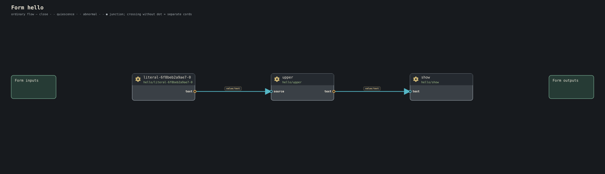

This page starts with source that exists in the current `dev` tree, then moves into newer canonical surfaces.

## Hello: a finite pipeline

Current tree: [forms/hello/main.conduit](https://github.com/dancxjo/conduit/blob/dev/forms/hello/main.conduit)

```conduit
form hello {
    upper: text/upper
    show: presentation/text

    "Hello, world." >> upper >> show
}.
```



There is no explicit main function, process, display handle, or stdout. The form composes semantic work. The full stop says drain completes the form.

## Clock: a standing live form

Current tree: [forms/clock/main.conduit](https://github.com/dancxjo/conduit/blob/dev/forms/clock/main.conduit)

```conduit
form clock-demo {
    clock: time/every(1s)
    clock >> presentation/tick
}
```


No trailing full stop. The form remains alive between ticks.

## Memory Lantern: input, editing, and Current

Current tree: [forms/memory-lantern/main.conduit](https://github.com/dancxjo/conduit/blob/dev/forms/memory-lantern/main.conduit)

```conduit
form memory_lantern {
    keyboard: input/keyboard
    keymap: input/keymap
    message: text/edit(maximum-bytes = 256)
    show: presentation/text

    keyboard.key >> keymap.key
    keymap.text >> message.fragment
    message.current >> show.text
}
```

The editor exposes current text. The form does not own a window, DOM node, terminal, or framebuffer.

## Pocket Theremin: quantities and retained state

Current tree: [forms/pocket-theremin/main.conduit](https://github.com/dancxjo/conduit/blob/dev/forms/pocket-theremin/main.conduit)

```conduit
form pocket-theremin (
    >> distance: Distance
    audio: audio/pcm-frames@1...| >>
) {
    map: math/map-distance-frequency(
        source-minimum = 0cm,
        source-maximum = 30cm,
        target-minimum = 220Hz,
        target-maximum = 880Hz
    )
    frequency: keep Frequency(440Hz) for this play
    tone: audio/tone

    distance >> map.distance
    map.frequency >> frequency
    frequency >> tone.frequency
    tone.audio >> audio
}.
```

The units are semantic. The `keep` is current frequency state. Browser audio, hosted audio, or a future native realization can sit behind the same meaning.

The `@1` catalog spelling in some current-tree examples is implementation/migration history, not a reason to invent new version-suffix syntax in authored canon.

## Button across the room: meaning without transport

Current tree: [forms/button-across-room/main.conduit](https://github.com/dancxjo/conduit/blob/dev/forms/button-across-room/main.conduit)

```conduit
form button_across_room {
    button: input/button
    state: input/button-indicator-state
    indicator: presentation/indicator-state

    button >> state >> indicator
}
```

Nothing here says whether button and indicator are on the same host. If planning places them apart, a line may realize the crossing cord.

## Desk Telegraph: reusable forms as gears

Current tree: [forms/desk-telegraph/main.conduit](https://github.com/dancxjo/conduit/blob/dev/forms/desk-telegraph/main.conduit)

```conduit
form text-record (
    text: Text >> record: TypedRecord
) {
    wrap: record/text-to-typed
    text >> wrap.text
    wrap.record >> record
}

form bounded-record-send (
    maximum-items: Count = 4
    maximum-frame-bytes: Count = 4096
    frame: FramedTypedRecord >> queued: FramedTypedRecord
) {
    queue: record/ordered-send-queue(maximum-items, maximum-frame-bytes)
    frame >> queue >> queued
}
```

These are two complete declarations excerpted from the larger Desk Telegraph source. A form can itself define reusable semantic work and then be invoked like another kind.

## Firefly Choir: omission is semantic composition

Current tree: [forms/firefly-choir/main.conduit](https://github.com/dancxjo/conduit/blob/dev/forms/firefly-choir/main.conduit)

```conduit
form pulse-manifestation (
    >> tick: value/tick@1...
) {
    observe: time/pulse-observe(period-ms = 240)
    light: presentation/pulse

    tick >> observe.tick
    observe.observation >> light.pulse
}
```


This is light-only because there is no tone gear and no tone cord. Sound is not a runtime flag that a host may quietly toggle.

## Explicit enrichment

```conduit
form pulse-light-tone-manifestation (
    >> tick: value/tick@1...
) {
    observe: time/pulse-observe(period-ms = 240)
    light: presentation/pulse
    tone: sound/pulse-tone

    tick >> observe.tick
    observe.observation >> light.pulse
    observe.observation >> tone.pulse
}
```


The fan-out is visible.

## Bounded navigation: portable intent down to motion requests

Current tree: [forms/bounded-navigation/main.conduit](https://github.com/dancxjo/conduit/blob/dev/forms/bounded-navigation/main.conduit)

```conduit
form bounded-navigation (
    >> pose: NavigationPose
    >> goal: NavigationGoal
    >> traversability: NavigationTraversability4x4
    >> time: NavigationTime
    decision: NavigationRouteDecision >>
    control: NavigationControl >>
    request: RoboticsMotionRequest >>
) {
    route: navigation/route-grid4
    timing: navigation/time-parameterize
    controller: navigation/local-control

    pose >> route.pose
    goal >> route.goal
    traversability >> route.traversability
    time >> route.time
    route.decision >> decision
    route.decision >> select(NavigationRouteDecision.route, unmatched=drop) >> timing.route
    time >> timing.time
    timing.trajectory >> controller.trajectory
    pose >> controller.pose
    time >> controller.time
    controller.control >> control
    controller.control >> select(NavigationControl.motion, unmatched=drop) >> request
}
```

The form ends at semantic body-motion intent. Robot authority and actuator lowering belong to the plan and host realization.

## body Chat: application meaning, model choice still realization

Current tree: [forms/body-chat/main.conduit](https://github.com/dancxjo/conduit/blob/dev/forms/body-chat/main.conduit)

```conduit
form body-chat (
    >> interaction: FaceInteraction...|
    face: Presentation...| >>
) {
    ui: chat/state(title = "Body Chat", history-label = "Conversation", input-label = "Message", submit-label = "Send", status-label = "Body", maximum-history-items = 16, maximum-message-bytes = 256)
    submit: chat/submit(action = "chat/send", maximum-message-bytes = 256)
    available: boolean/literal(value = true)
    availability: chat/current-connection
    context: body/conversation-context
    prompt: body/chat-prompt
    model: llm/generate-flow(maximum-input-bytes = 4096, maximum-context-items = 1, maximum-output-bytes = 2560, maximum-work-units = 4096, maximum-history-items = 0)
    text: llm/result-flow-to-text

    available.value >> availability.source
    availability.value >> ui.live
    ui.presentation >> face
    interaction >> submit.interaction
    submit.message >> prompt.message
    context.context >> prompt.context
    prompt.human-message >> ui.message
    prompt.request >> model.request
    model.result >> text.result
    text.text >> prompt.response
    prompt.body-message >> ui.message
}
```

The semantic model operation is named. Provider protocol, URL, credentials, or Ollama identity do not belong in the form.

## A mask is an ordinary form

Current tree: [forms/native-graphical-mask/main.conduit](https://github.com/dancxjo/conduit/blob/dev/forms/native-graphical-mask/main.conduit)

```conduit
form native-graphical (
    >> face: Presentation
    interaction: FaceInteraction...| >>
    show: Show >>
) {
    spread: presentation/tee
    surface: presentation/show-resource-source
    render: presentation/resource-renderer
    human: face/interaction

    face >> spread.presentation
    spread.presentation >> render.presentation
    surface.show-resource >> render.show-resource
    spread.presentation >> human.presentation
    render.show >> human.show
    render.show >> show
    human.interaction >> interaction
}
```

mask is a role, not a special declaration or second UI language.

## Checked refinements

Canonical:

```conduit
form guarded (
    >> name: Text <= 32B not in ["root", "admin"]
    >> count: Count in 1..=100
    >> code: Text <= 64B ~ /[A-Z]{2}[0-9]{2}/
) {
    ...
}
```

These relations become part of checked semantic type identity.

## Glyphs remain inspectable gears

Canonical:

```conduit
with text/upper as ^^

input ^^ output
a >< b >< c >> merged
note @ save-request >> snapshot
```

The checker can always expose `text/upper`, `flow/merge`, and `current/sample` behind the concise spelling.

## A native semantic type

Merged current tree:

```conduit
type LinguisticOffsetBasis =
    unicode_scalar
    | utf8_byte
```

The Rust binding is generated from this authored type.

## One type family, exact concrete values

The current [data types](https://github.com/dancxjo/conduit/blob/dev/semantics/data/types.conduit)
include this generic record and its bounded-text specialization:

```conduit
type DataGenerationValue<T> = {
    namespace: DataGenerationNamespace
    value: T
}

type DataGenerationTextValue = DataGenerationValue<Text <= 4096B>
```

`DataGenerationNamespace` is defined in that same source. `T` ranges over
checked semantic types, and the application fixes one exact finite value shape
before play. Generated bindings consume that checked shape. The generic family
does not imply unbounded values or a runtime type-erasure layer.

## Separate origin from certainty

These declarations are taken from
[the human-experience types](https://github.com/dancxjo/conduit/blob/dev/semantics/human/types.conduit):

```conduit
type ExperienceOrigin =
    observation
    | human_reported
    | remembered
    | model_derived
    | imagined

type ExperienceTemporalRole =
    current
    | recent
    | stale
    | historical

type ExperienceCertainty =
    certain
    | uncertain
```

Origin, age, and certainty are different facts. An uncertain observation and a
certain recollection should not collapse into one flag. These finite variants
make the distinctions available to checking and generated bindings; the
vocabulary alone does not prove an observation happened or make every consumer
report it honestly. That still needs the source's evidence and the consuming
contract.

## A pack

Canonical:

```conduit
pack house/sensors (
    version = 1.4.0
) {
    ship temperature
    need math/geometry = ^2.1
}
```

`conduit.lock` carries exact resolved truth. Imports grant no runtime authority.

## body wardrobe

Canonical:

```conduit
with masks/native-graphical as graphical
with masks/spoken as spoken

body roseau {
    wear graphical, spoken
    want graphical over spoken
}
```

The body permits either mask. The optional `want` line expresses its preference;
the comma list does not.

## host construction

Canonical:

```conduit
host tiny-screen (
    target = conduitos/x86_64/pc
    build = release
) {
    surface: resource presentation/surface (
        slots = 2
        bytes = 2MiB
    )

    display: base machine/display

    graphics: back presentation/graphics (
        surface = surface
        display = display
    )

    bounds = {
        heap: 8MiB,
        calls: 32,
        signs: 256
    }
}
```

This is construction source. A successful parse does not claim the machine booted or the display exists.

## Bounded collection behavior

A reusable form can take exact checked behavior as a parameter. This is the
`flow/each` wrapper from the
[activation tests](https://github.com/dancxjo/conduit/blob/dev/architecture/form/src/activation_tests.rs):

```conduit
form flow/each (
    item: type
    result: type
    transform: kind (
        >> value: item
        mapped: result >>
    )
    >> values: item...|
    mapped: result...| >>
) {
    each: activate(maximum-items = 4) transform()
    values >> each.value
    each.mapped >> mapped
}
```

`transform` is checked at specialization time. `activate` bounds its work and
keeps each selected invocation inspectable. The wrapper's name is defined by
this source; it is not a promise that bare `flow/each(...)` resolves everywhere.

For selection, folding, scanning, and collection proof, continue with
[[bounded activation in the reference|Current-language-surface#bounded-each-select-fold-and-scan]].
That reference gives the exact body fragments, required fores, and std/browser
proof boundaries. [#4378](https://github.com/dancxjo/conduit/issues/4378) is
completed work, not a remaining syntax gap.

## A record owns its law

```conduit
type Interval = {
    start: U32
    end: U32
    where .start <= .end
}
```

The law belongs to the type and is enforced when generated bindings construct
or decode a value. See the real
[TextSpan declaration](https://github.com/dancxjo/conduit/blob/dev/semantics/language/types.conduit).
This does not yet mean every consuming form can erase an arithmetic check from
that fact; [#4639](https://github.com/dancxjo/conduit/issues/4639) owns that work.
