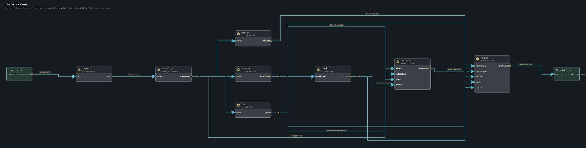
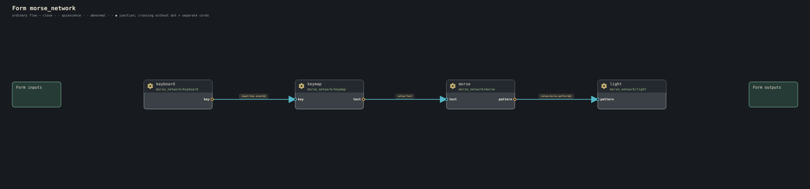
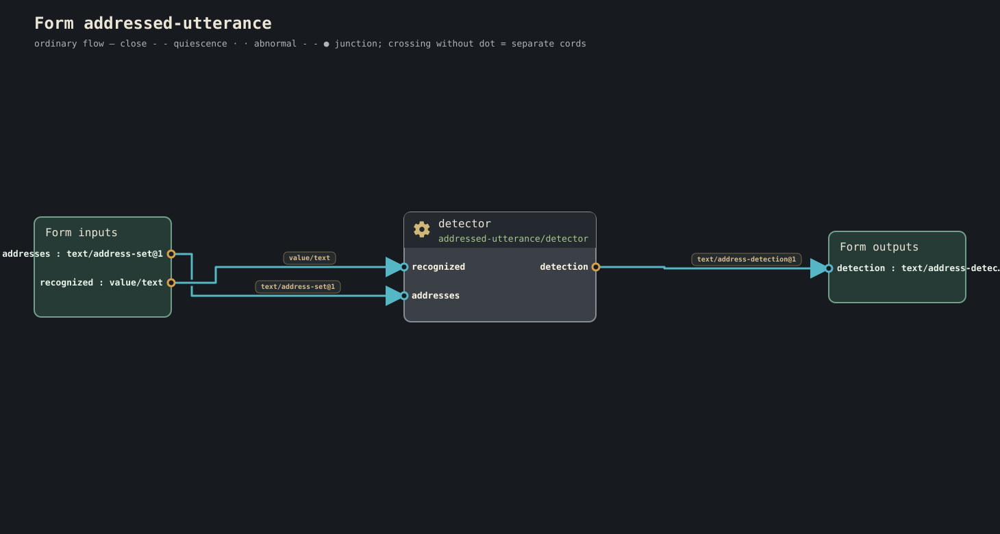

# Form diagrams

These diagrams are generated from checked Conduitese with the public
`conduit diagram` entrance. They show every gear in the form and the exact
cords between named ports.

On each gear, the large label is the **port name**. The smaller label is the
port's **info type**, which is also used on cord labels. Arrowheads show flow;
a marked junction is a real fan-in or fan-out, while crossing cords without a
junction remain separate.

Generate the same view locally with:

```sh
conduit diagram forms/vision/main.conduit --output vision.svg
```

## A few forms at a glance

### Vision



### Firefly choir


### Morse network



### Addressed utterance



## Diagram index

- [Addressed utterance](assets/form-diagrams/addressed-utterance--main.svg)
- [Arithmetic lesson](assets/form-diagrams/arithmetic-lesson--main.svg)
- [Bounded job](assets/form-diagrams/bounded-job--main.svg)
- [Bounded stroke capture](assets/form-diagrams/bounded-stroke-capture--main.svg)
- [Breadboard instrument](assets/form-diagrams/breadboard-instrument--main.svg)
- [Clock](assets/form-diagrams/clock--main.svg)
- [Count](assets/form-diagrams/count--main.svg)
- [Default welcome](assets/form-diagrams/default-welcome--main.svg)
- [Firefly choir](assets/form-diagrams/firefly-choir--main.svg)
- [Firefly line follower](assets/form-diagrams/firefly-line-follower--main.svg)
- [Generalized input](assets/form-diagrams/generalized-input--main.svg)
- [Geometry spatial](assets/form-diagrams/geometry-spatial--main.svg)
- [Greet](assets/form-diagrams/greet--main.svg)
- [Heartbeat phase follower](assets/form-diagrams/heartbeat-phase-follower--main.svg)
- [Hello](assets/form-diagrams/hello--main.svg)
- [Lenia Orbium](assets/form-diagrams/lenia-orbium--main.svg)
- [Little Life](assets/form-diagrams/little-life--main.svg)
- [Messaging delivery](assets/form-diagrams/messaging-delivery--main.svg)
- [Morse network](assets/form-diagrams/morse-network--main.svg)
- [Native graphical mask](assets/form-diagrams/native-graphical-mask--main.svg)
- [Network resolution](assets/form-diagrams/network-resolution--main.svg)
- [Patchbay front door](assets/form-diagrams/patchbay-front-door--main.svg)
- [Phase synchronization](assets/form-diagrams/phase-synchronization--main.svg)
- [Pulse observation](assets/form-diagrams/pulse-observation--main.svg)
- [Rhythm lesson](assets/form-diagrams/rhythm-lesson--main.svg)
- [Robotics diversity](assets/form-diagrams/robotics-diversity--main.svg)
- [Robotics range](assets/form-diagrams/robotics-range--main.svg)
- [Route annotation stroke](assets/form-diagrams/route-annotation-stroke--main.svg)
- [Scheduling workflow](assets/form-diagrams/scheduling-workflow--main.svg)
- [Signal demo](assets/form-diagrams/signal-demo--main.svg)
- [Spoken mask](assets/form-diagrams/spoken-mask--main.svg)
- [Vision](assets/form-diagrams/vision--main.svg)
- [Vision metadata](assets/form-diagrams/vision-metadata--main.svg)

## Coverage

This gallery contains the 33 forms that the standard product catalogs can
check directly. Other source forms currently depend on additional kind
catalogs or signatures and are therefore rejected before diagram generation.
That distinction is intentional: this page does not substitute unchecked or
stale pictures for a checked Form.

