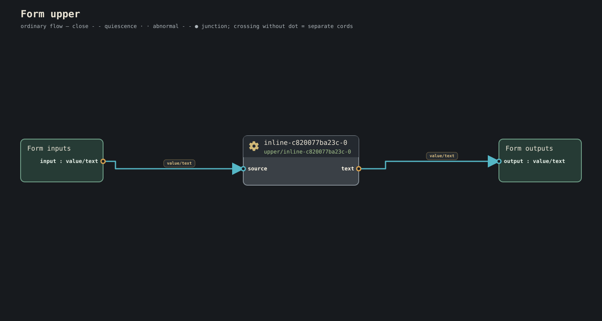

## plots and completion

For a visual companion to the syntax below, browse the generated
[[Plot diagrams|Plot-diagrams]].

A plot is **live by default**. The language has two paired altitude stories:
`type -> form` for value meaning and portable representation, and
`plot -> plan -> play` for authored work, admitted realization, and execution.
A plot is not its plan or play, and a form is not the semantic type it
represents.

```conduit
plot live-example (
    >> reading: Temperature...
    label: Text... >>
) {
    reading >> (. > 30°C ? "hot" : "fine") >> label
}
```

A trailing full stop after the closing brace declares **semantic completion on structural drain**:

```conduit
plot finite-example (
    >> input: Text
    output: Text >>
) {
    input >> text/upper >> output
}.
```


## Semantic full stop: `}` versus `}.`

The full stop belongs to the **plot as a whole**, not to the sequence of statements inside its back.

Canonical law:

```text
}     structural drain = quiescence; the play remains live for later admitted work
}.    structural drain = semantic fulfillment; the play terminates normally as completed
```

More precisely:

> A trailing `.` on the plot declares that when its admitted realization reaches **structural drain under the ordinary scheduler law**, that drain is a sufficient completion witness for the plot's authored meaning.

The period does **not** mean “stop executing now,” and it is not an executable statement, gear, cord, effect, cancellation request, or timeout.

It also does **not** mean “terminate whenever nothing happens to be runnable this instant.” Temporary lack of runnable work, an outstanding admitted activation, waiting input/provider work, or any other condition that has not reached the scheduler's actual structural-drain state is not promoted to completion by punctuation.

Without the trailing full stop, the same structural drain is **quiescence**. The exact play remains alive and may continue when later admitted input or activation arrives.

With the trailing full stop, the same structural drain is **semantic completion**. The play may terminate normally with completed disposition.

Thus the punctuation changes checked meaning, plan completion policy, and lifecycle behavior:

```text
plot ... { ... }     live plot
plot ... { ... }.    finite-on-drain plot
```

This is intentionally punctuation on the plot boundary. Do **not** encode semantic completion as a freestanding `.` statement inside the body.

The current parser rejects a standalone body `.`; put completion punctuation after the closing brace.

The English keyword `complete` is **not Conduitese** and must be rejected rather than retained as a compatibility alias.

A standalone `...` is not a runnable body statement. In documentation it may mark an omitted implementation; in an authored port type, `T...` has the distinct checked meaning of a flow.

Provenance: #3939 plus this canonical amendment in #4109.
---

## cords and fore direction: `>>`

`>>` is the **one canonical authored cord/direction token**.

```conduit
source >> transform >> sink

plot upper (
    >> input: Text
    output: Text >>
) {
    input >> text/upper >> output
}
```



Where a paired fore is useful:

```conduit
plot upper (
    input: Text >> output: Text
) {
    input >> text/upper >> output
}
```


The ordinary operators `>`, `<`, `>=`, and `<=` belong to comparison/constraint mathematics, **not graph carriage**.

Reserve expression shifts:

```text
>>    cord / fore direction
>>>   right shift in pure expressions
<<<   left shift in pure expressions
```

Historical `>` cord source remains historical evidence. **Do not make `>` a current compatibility spelling.**

Provenance: #3967.

---

## Pure one-input expressions

A pure expression has **one current runtime input**, written:

```text
.        whole input
.field   record field
.0       tuple element
```

and may reference immutable lexical/startup values.

Pure expressions are finite and may not hide:

- host calls/effects;
- keep/state ownership;
- a second temporal input;
- waits/suspension;
- clock/random/resource acquisition except as explicit semantic input.

Examples:

```conduit
reading >> (.temperature > 30°C ? "hot" : "fine") >> label
flags >> ((. >>> 8) & 0xff) >> byte
```

## Ternary

Canonical pure value-selection sugar:

```conduit
condition ? yes : no
```

The condition is Boolean, branches unify to one exact finite result type/bound, and only the selected pure branch evaluates.

Ternary is **not graph routing**.

Provenance: #3964, #3969.

---

## Systems-grade scalar expressions

Pure expressions admit exact fixed-width integer types when width is semantic:

~~~text
U8 U16 U32 U64 U128
I8 I16 I32 I64 I128
~~~

Canonical integer literal families include decimal, hexadecimal, binary and octal with optional readability separators:

~~~text
255
0xff
0x8000_0000
0b1000_0001
0o755
~~~

Do not import C integer promotions, host-sized `usize/isize`, target-dependent wrapping, UB, or silent truncation.

Canonical Boolean operators:

~~~text
!a
a && b
a || b
~~~

Canonical bitwise operators for admitted exact integer/bitset types:

~~~text
a & b
a | b
a ^ b
~~~

Shift spelling remains:

~~~text
>>>   right shift
<<<   left shift
>>    Cord / Fore direction, never an expression shift
~~~

Right-shift behavior follows checked signedness. Out-of-range shift counts require one portable checked refusal/result law rather than host-language masking/UB.

Ergonomic number law:

> **Make unsafe ambiguity impossible; do not make machine widths homework.**

Use exact widths where representation is meaning (register/wire/device/ABI). Ordinary arithmetic/counts/quantities should normally use semantic numeric types with planner/compiler-selected safe representation inside exact bounds.

Required precedence, highest to lowest:

~~~text
primary / projection
unary
* / %
+ -
<<< >>>
< <= > >=
== !=
&
^
|
&&
||
?:
>> Cord outside expression islands
~~~

No operator meaning may depend on whitespace.

Provenance: #3964, #3967, #4014.

---

## Immutable locals

Canonical local binding:

```conduit
limit = 30°C
matrix = { a: 1, b: 0, c: 0, d: 1 }
```

A complete example captures an immutable local threshold:

```conduit
plot threshold (
    >> value: U32
    result: Boolean >>
) {
    limit = 100
    value >> (. > limit) >> result
}
```

`=` declares an immutable lexical relationship. It is not assignment and not temporal sequencing.

No shadowing of startup parameters, ports, gear names, locals, or imported aliases in the same scope.

Local dependency cycles refuse. Runtime-flow capture requires explicit graph/value machinery and must not turn locals into hidden state.

Provenance: #4052.

---

## Exactly-one graph routing

The current checked grammar uses `PATTERN >> ROUTE` inside a matched route.
These are source fragments whose endpoint names and exact types must be in scope:

```conduit
notice >> ? {
    [Notice.delivery == "visible"] >> display
    [Notice.delivery == "spoken"] >> speak
    _ >> silence
}

event >> ? {
    [MusicEvent.note] >> play-note
    [MusicEvent.rest] >> keep-silence
}
```

A field-equality route carries the whole record. A variant route carries the
selected case payload. The route connects that carried value directly to its
first destination; no payload placeholder is needed. Equality patterns must
name one exact record type and field, have distinct checked values, and end
with an otherwise track. Variant routes must enumerate every case exactly
once. Mixing these pattern families refuses.

At the beginning of an arm, `_` before `>>` means **otherwise**. The current
checker also accepts a leading route-stage `_` as a carried-value placeholder:
`[MusicEvent.note] >> _ >> play-note` is equivalent to the direct route above.
It rejects `_` later in that track. This existing placeholder is not a discard
operation. The proposed distinction between a `.` payload placeholder and a
bare `_` discard is not implemented by this grammar; do not use it as current
runnable source. Likewise, colon arms and arbitrary Boolean graph guards are
not accepted here. Use `when(...)` for a checked Boolean filter.

Exactly-one routing keeps unselected work inactive; checked expansion still
retains every possible route in the graph. The
[selector tests](https://github.com/dancxjo/conduit/blob/dev/architecture/plot/tests/structured_selectors.rs)
cover exhaustive cases, equality routes, carried values, overlap and missing
otherwise refusal. These tests establish checking and expansion, not a claim
that every arbitrary destination has an installed target back.

Provenance: #3938, #4062; current parser/checker conformance.

---

## Unary filter sugar: `when`

Canonical unary value filter:

```conduit
temperature >> when(. > limit) >> alarm
```

It lowers to one ordinary checked pure-filter gear. A rejected flow item does not appear downstream; a rejected ordinary value produces the finite optional result.

It has one current runtime input `.` and may capture immutable lexical/startup values.

It does **not** hide a second temporal input or temporal join.

For flows it preserves modality/terminal law:

```text
T...  -> T...
T...| -> T...|
```

For one `T`, rejecting the value must have an explicit zero-or-one/optional law, naturally `T?`; it must not pretend to remain unconditional `T -> T`.

There is **no pre-release `where` compatibility alias**.

Provenance: #4044.

---

## Source gears

A source gear is ordinary checked work whose activation may originate from an admitted external condition rather than an upstream runtime data cord.

Examples: timer, input device, network receive, sensor observation.

There is **no callback syntax and no second event-loop runtime**. External readiness enters the same bounded scheduler/kernel activation model and obeys ordinary pressure, terminal and lifecycle law.

Provenance: #4060.

---

## Pure semantic kind-call sugar

Reviewed pure semantic kinds may use function-shaped expression sugar:

```conduit
sine = math/sin(angle)
```

For a catalog kind, this lowers to ordinary semantic kind application. The checker derives eligibility from the selected kind contract. Built-in finite observations and widening, such as `sequence/length`, `bytes/at`, and `value/u64`, are separately checked expression operations; their function-shaped spelling does not require a fictitious installed catalog kind.

Eligibility is derived from checked semantic properties. Authors do not write “pinky promise this is pure.”

Effectful, stateful, suspending or authority-bearing kinds refuse in pure expression context.

Provenance: #4053, #4070, #4071.

---

## Complete expression plots

The expression-body spelling and an explicit pipeline have the same checked
meaning in the [canonical expansion tests](https://github.com/dancxjo/conduit/blob/dev/architecture/plot/src/canonical_expansion_tests.rs):

```conduit
plot scale (
    factor: U8 = 2
    >> value: U8
    result: U8 >>
) = (. * factor)

plot scale-explicit (
    factor: U8 = 2
    >> value: U8
    result: U8 >>
) {
    value >> (. * factor) >> result
}
```

The runtime input is `.`; `factor` is an immutable startup value. Arithmetic
that cannot be proven safe keeps its portable runtime check. For example,
scaling a `U8` by 2 does not authorize silent wrapping on overflow.

These complete expressions demonstrate the remaining operator families;
their carrier, overflow, zero-divisor, and shift-count checks remain part of
the finite expression contract:

```conduit
plot quotient (
    value: U32 >> result: U32
) = (. / 2)
plot remainder (
    value: U32 >> result: U32
) = (. % 2)
plot next (
    value: U32 >> result: U32
) = (. + 1)
plot previous (
    value: I32 >> result: I32
) = (. - 1)
plot negative (
    value: I32 >> result: I32
) = (-.)
plot bits (
    value: U32 >> result: U32
) = (((. >>> 8) & 0xff) | ((. ^ 0xff) <<< 1))
plot accepted (
    value: I32 >> result: Boolean
) = (!(. < 0) && . <= 100 || . == 200)
plot different (
    value: I32 >> result: Boolean
) = (. != 0 && . >= -10 && . > -20)
```

Width changes are explicit and must represent the complete source domain.
This example comes from the [integer widening tests](https://github.com/dancxjo/conduit/blob/dev/architecture/plot/tests/integer_widening.rs):

```conduit
plot widen (
    value: U8 >> result: U64
) = (value/u64(value/u16(.)) * 256 + 33)
```

Input 255 produces 65313. Narrowing, same-width conversion and signed-to-unsigned
conversion are refused by this widening surface.

## Text and source spelling

```conduit
# Unicode text is authored directly; escapes retain their original spans.
plot greeting {
    message = "Hello, β.\n\t\"quoted\" \\ path"
    message >> presentation/text
}.
```

Double-quoted text admits the reviewed newline, tab, quote and backslash
escapes. UTF-8 byte bounds and scalar source positions remain distinct.
Unknown escapes refuse; no implicit Unicode normalization changes an authored
spelling. The [quoted source tests](https://github.com/dancxjo/conduit/blob/dev/architecture/plot/tests/quoted_text_source.rs)
check decoded-to-original span correspondence. `#` starts a source comment
outside quoted text.

## Glyph composition and exact selectors

These scoped fragments name ordinary gears through the standard glyph prelude:

```conduit
a >< b >< c >> merged
left &> right >> paired
first ?> second >> winner
current-left <> current-right >> latest-pair
note @ save-request >> snapshot
```

They mean merge, zip, race, combine-latest, and Current sampling respectively.
The actual input/output types and temporal relationships come from each exact
fore; these fragments do not define a universal pair or race contract. Mixed
adjacent glyphs need explicit grouping. `sans glyphs` disables the default
prelude; explicit glyph imports remain available.

Exact structured selectors are also ordinary checked cord stages:

```conduit
feedback >> project(Feedback.status) >> presentation
pitches >> index(PitchTable[1]) >> synth
events >> select(MusicEvent.note, unmatched=drop) >> notes
events >> select(MusicEvent.note, unmatched=refuse) >> required-note
```

`project` checks the named record field. `index` checks an exact collection's
static index. `select` chooses a variant payload, explicitly dropping or
refusing unmatched cases. This `select` is distinct from the bounded predicate
activation coordinator. See the
[structured selector tests](https://github.com/dancxjo/conduit/blob/dev/architecture/plot/tests/structured_selectors.rs)
and [[bounded behavior examples|Current-language-surface#bounded-each-select-fold-and-scan]].

## Lexical helpers and shared pools

A nested plot is a lexical declaration, not a runtime closure:

```conduit
plot outer (
    >> value: Text
    result: Text >>
) {
    plot helper (
        >> value: Text
        result: Text >>
    ) {
        value >> result
    }

    value >> helper() >> result
}
```

Nested declarations do not implicitly capture runtime ports or Current.
Reusable behavior receives its runtime data through an exact fore. The
[lexical plot tests](https://github.com/dancxjo/conduit/blob/dev/architecture/plot/src/syntax_check_tests.rs)
cover scoped resolution and refusal boundaries.

A shared pool declaration creates one bounded pool identity that can be passed
as an explicit startup value. This signature specimen follows the
[pool checking fixtures](https://github.com/dancxjo/conduit/blob/dev/architecture/plot/src/syntax_check_tests.rs):

```conduit
plot peer (
    recv: Text...| >> send: Text...|
) {
}

plot room {
    pool peers: peer(size = 2)
}
```

The empty peer body demonstrates the declaration contract only. A pool is not
an ordinary runtime endpoint; `source >> peers` is refused. Size must be a
positive finite admitted count. Consumers receive the same pool through an
explicit `Pool` startup parameter, rather than accidentally allocating separate
pools. See the
[shared pool expansion tests](https://github.com/dancxjo/conduit/blob/dev/architecture/plot/src/canonical_expansion_tests.rs).
